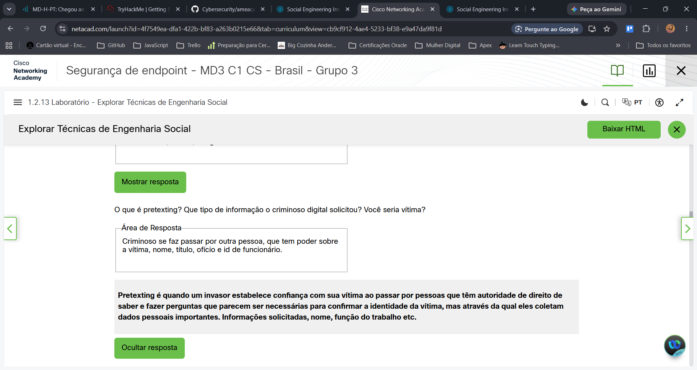
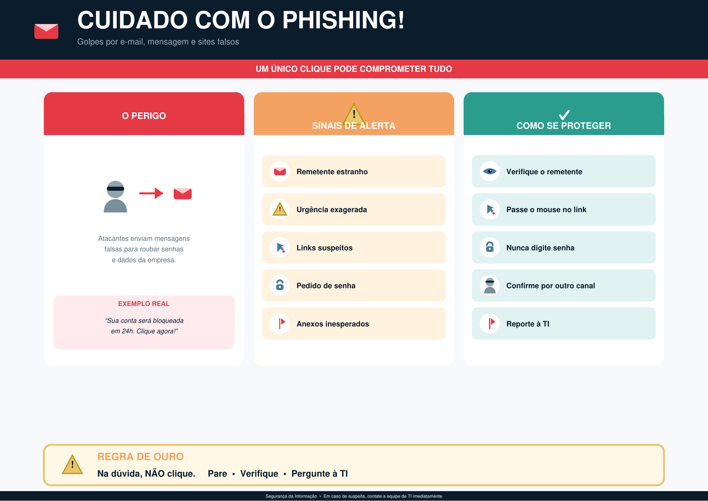

# Lab 1.2.13 - Explorar Técnicas de Engenharia Social

## Descrição
Análise prática e estudo detalhado sobre as principais técnicas de **Engenharia Social** (*hacking humano*), explorando como os invasores utilizam manipulação psicológica, engano e exploração de comportamentos para comprometer sistemas e obter dados confidenciais.

## Objetivo
Identificar, categorizar e compreender a mecânica de operação de ataques baseados no fator humano (virtuais e físicos) para propor medidas eficazes de prevenção, mitigação e conscientização em cibersegurança.

## Contexto & Recursos Utilizados
Atividade prática realizada no curso **Segurança de Endpoint da Cisco (Networking Academy)**, integrada à preparação para a certificação **Cisco Certified Support Technician (CCST) Cybersecurity**.

* **Ferramenta/Recurso Interativo:** Para a realização da simulação prática e resposta aos cenários do laboratório, foi utilizada a aplicação interativa [CSSIA Social Engineering Interactive](https://www.cssia.org/socialengineering/) promovida pelo *National Support Center for Systems Security and Information Assurance (CSSIA)*.

---

## 📸 Evidências do Laboratório e Material Produzido

### 1. Resolução dos Cenários no Cisco NetAcad

*> Análise de cenários interativos sobre vetores de ataque humano e validação prática das técnicas.*

### 2. Pôster de Conscientização: Prevenção contra Phishing (Parte 2)

*> Material gráfico desenvolvido para orientar colaboradores sobre como identificar e evitar e-mails e links maliciosos de Phishing no ambiente corporativo.*

---

## Passos Realizados

1. **Análise de Cenários Interativos na Aplicação CSSIA:**
   * **Isca (Baiting):** Análise da promessa falsa de ganhos e infecção por malware ao aceitar simulações com mídias físicas/downloads.
   * **Navegação Bisbilhoteira (Shoulder Surfing):** Identificação do uso de câmeras/celulares para captura visual de logins, senhas e PINs digitados pela vítima.
   * **Pré-texto (Pretexting):** Estudo de invasores personificando papéis de autoridade (cargo, nome, ID) para solicitar confirmação de dados confidenciais.

2. **Estudo de Golpes e Disfarces Digitais e Físicos:**
   * **Phishing, Spear Phishing e Caça à Baleia (Whaling):** Diferenciação entre e-mails massivos com avisos falsos de débitos/retiradas, ataques direcionados e focado em executivos (CFO/CEO).
   * **Ransomware e Scareware:** Avaliação de táticas de extorsão via criptografia de arquivos e mensagens alarmantes.
   * **Mergulho no Lixo (Dumpster Diving):** Riscos do descarte inadequado de papéis, credenciais e mídias físicas.
   * **Falsificação de Identidade (Impersonation) e Farsas (Hoaxes):** Engano via falsos alertas de vírus e personificação de marcas ou colegas.
   * **Caroninha / Traslado (Tailgating / Piggybacking):** Acesso físico indevido seguindo funcionários em áreas restritas.

3. **Táticas Avançadas de Manipulação:**
   * **Autoridade, Intimidação, Urgência e Escassez:** Exploração da obediência, medo de sanções e pressão de tempo/ofertas limitadas.
   * **Consenso (Prova Social), Familiaridade e Confiança:** Uso da opinião da maioria, perfis clonados e criação de falsos relacionamentos.
   * **Ataque do Regador (Watering Hole) e Typosquatting:** Infecção de sites frequentes da empresa e erros de digitação em URLs.
   * **Fraude da Fatura e Remoção de Adendo:** Faturas falsas e alteração de marcadores de e-mails externos.

4. **Elaboração do Pôster de Conscientização (Parte 2):**
   * Criação de um material educacional voltado especificamente para o ataque de **Phishing**, detalhando os principais sinais de alerta em e-mails (remetentes falsos, senso de urgência, anexos suspeitos) e boas práticas de segurança corporativa.

---

## Resultado
* **Vulnerabilidade Comportamental:** Confirmação de que o interesse por facilidades (Isca) ou a validação incorreta de identidades (Pretexting) causam infecção direta por malware e vazamento de credenciais.
* **Ameaças Físicas e Visuais:** Validação de que credenciais e dados de acesso são facilmente capturados por lentes de dispositivos móveis (Shoulder Surfing) e acessos não autorizados por portas sem eclusa (Tailgating).
* **Engano Técnico:** Mapeado como domínios parecidos (Typosquatting) e telas de login falsas são usados para interceptação de dados bancários e de acesso.
* **Material Educativo (Phishing):** Produção do pôster de conscientização, servindo como ferramenta prática de mitigações baseadas no fator humano.

---

## Aprendizados
* **Fator Humano como Elo Frágil:** A infraestrutura técnica (firewalls, antivírus) perde eficiência se o usuário for induzido a entregar acessos ou executar arquivos maliciosos.
* **Medidas de Proteção Organizacional:**
  * **Conscientização:** Treinamentos contínuos contra Phishing, Engenharia Social e procedimentos de mesa limpa.
  * **Controles Físicos:** Uso de bloqueadores de tela (películas de privacidade), fragmentadoras de papel para descarte e eclusas (*Mantraps*) contra *Tailgating*.
  * **Controles Técnicos:** Implementação de Autenticação Multifator (MFA), filtros de e-mail e correções regulares de software.
