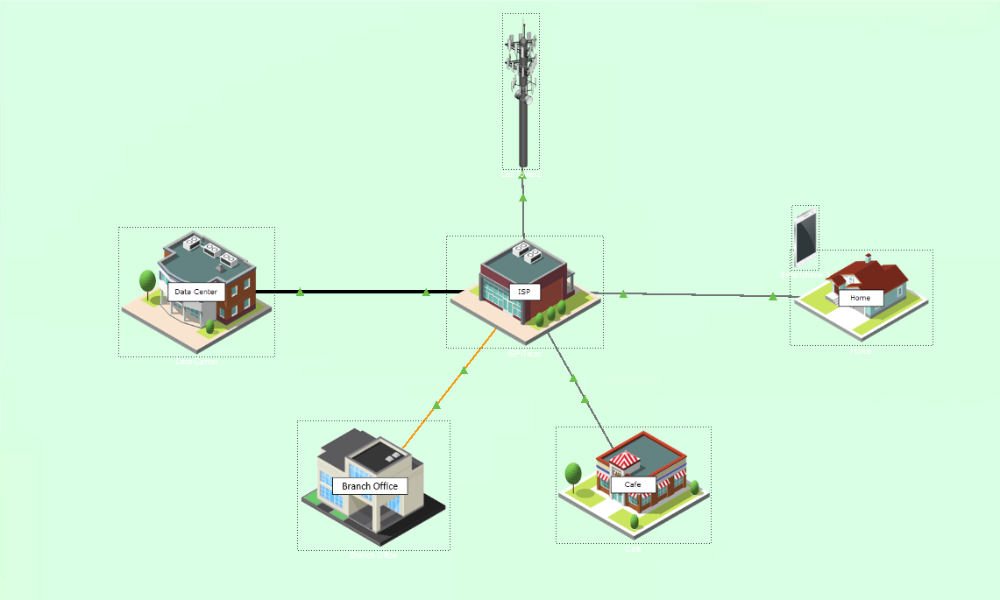
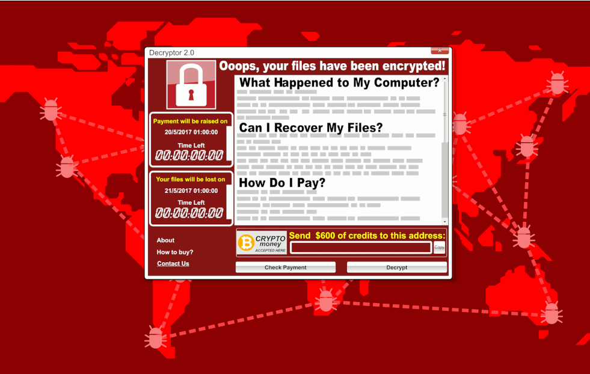
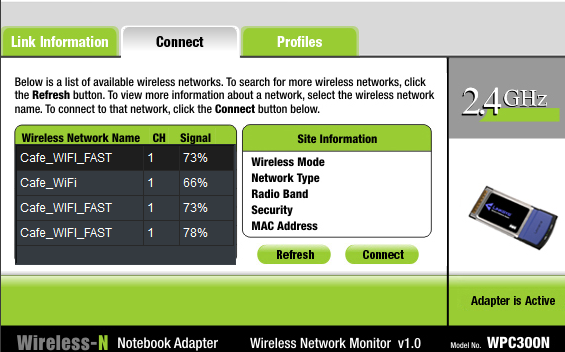

# 🧪 Activity 2.1.7 Packet Tracer - Investigue um Cenário de Ameaças

## 📌 Descrição
Análise investigativa de um cenário de ameaças realistas utilizando o **Cisco Packet Tracer**. A atividade simula a identificação e mitigação de vulnerabilidades divididas em três vetores principais: erros de configuração de rede, disseminação de malware via Phishing e ataques de Rogue AP (Access Point Não Autorizado) com sequestro de DNS.

## 🎯 Objetivos
* **Parte 1:** Investigar vulnerabilidades decorrentes de configurações incorretas na rede doméstica.
* **Parte 2:** Simular o envio e execução de e-mails de phishing com propagação de malware.
* **Parte 3:** Investigar pontos de acesso Wi-Fi falsos (*Rogue AP*) e sequestro de resolução DNS.

## 📍 Contexto
Atividade do Módulo **Protegendo redes** do curso **Segurança de Endpoint da Cisco (Networking Academy)**.

---

## 📸 Evidências e Capturas do Laboratório

### 1. Visão Geral da Topologia no Packet Tracer

*> Visão geral das redes Greenville, Filial e Café simuladas no Cisco Packet Tracer.*

---

## 🔍 Resolução & Perguntas da Atividade

### Parte 1: Vulnerabilidade de Configuração de Rede

* **Etapa 2 - Item b (Endereço IP do Gateway Padrão):**
  * **Pergunta:** Qual é o endereço IP usado?
  * **Resposta:** `192.168.100.1` *

* **Etapa 2 - Item e (Configurações Básicas Sem Fio):**
  * **Pergunta:** Quais das bandas estão ativas?
  * **Resposta:** 2,4 GHz, 5 Ghz-1 e 5GHz-2 **.
  * **Pergunta:** Quais são os SSIDs atribuídos a esses rádios?
  * **Resposta:** `Home_Net`, `Guest`, `Home_Net`,.

* **Etapa 2 - Item f (Segurança Sem Fio):**
  * **Pergunta:** A segurança está ativada para cada um dos rádios? As senhas estão definidas?
  * **Resposta:** A segurança é ativada para os rádios 2,4 GHz e 5 GHz-2. As senhas são definidas para os rádios. A segurança não está definida para o rádio de 5 GHz-1.

* **Etapa 2 - Item g (Rede de Convidados - Guest Network):**
  * **Pergunta:** A rede Guest está ativa? Em caso afirmativo, em qual rádio?
  * **Resposta:** Sim, ativa no rádio 2.4 GHz sem criptografia e permitindo acesso à LAN local.
  * **Pergunta:** O que você sugeriria que Bob fizesse para proteger essa rede?
  * **Resposta:** Desativar a rede Guest ou isolá-la da LAN interna (*Guest Isolation*), além de definir senha forte (WPA2/WPA3) para acesso à Wi-Fi.

---

### Parte 2: Vulnerabilidade de Malware de Phishing

*> Execução da simulação de ataque de Phishing via cliente de e-mail no Packet Tracer.*

* **Etapa 3 - Item c (Execução da URL maliciosa):**
  * **Pergunta:** O que aconteceu quando a página da Web foi carregada?
  * **Resposta:** O sistema exibiu um alerta informando que o dispositivo foi infectado por um malware.
  * **Pergunta:** Que tipo de ataque é esse?
  * **Resposta:** Engenharia Social / Phishing e infecção por Malware/Drive-by Download.
  * **Pergunta:** Descreva os danos que esse tipo de ataque pode causar em uma empresa:
  * **Resposta:** Exfiltração de dados confidenciais, sequestro de arquivos por Ransomware, perda de reputação e paralisação das operações da empresa.

---

### Parte 3: Vulnerabilidade de Rede Sem Fio e DNS

*> Captura da conexão com a rede Wi-Fi falsa (Cafe_WI-FI_FAST) e redirecionamento de site legítimo via DNS Hijacking.*

* **Etapa 1 - Item d (Escolha de Wi-Fi no Café):**
  * **Pergunta:** Se você estivesse no Café, a qual rede sem fio você escolheria se conectar? Explique.
  * **Resposta:** Conectar à rede `Café_Wi-Fi` (legítima), pois é a única com protocolo de segurança/criptografia ativado, evitando a rede aberta `Cafe_WI-FI_FAST` criada pelo agente de ameaças (*Rogue AP*).

* **Etapa 2 - Item b (Acesso ao site `friends.example.com`):**
  * **Pergunta:** O que aconteceu?
  * **Resposta:** Em vez de abrir a rede social legítima, o usuário foi redirecionado para um site malicioso de *phishing* controlado pelo invasor devido ao envenenamento/sequestro de DNS.

---

## 💡 Aprendizados e Mitigações

1. **Hardening de Dispositivos Domésticos/SOHO:** Redes de convidados devem sempre isolar o tráfego da rede interna (*LAN Isolation*) e exigir autenticação.
2. **Treinamento de Conscientização:** Usuários devem ser capacitados para identificar e-mails suspeitos e evitar clicar em links não verificados.
3. **Segurança de Wi-Fi Público:** Evitar redes Wi-Fi abertas e não criptografadas e utilizar VPNs em locais públicos para proteger contra ataques do tipo *Man-in-the-Middle* (MitM) e *DNS Spoofing*.
